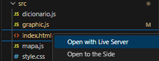

# Executando com VSCode e Live Server

Este arquivo contém um passo-a-passo para executar a aplicação localmente com uso da extensão Live Server, disponível no programa Virtual Studio Code.

## Pré-Requisitos

- Virtual Studio Code com Extensão "Live Server"
- Git: Version 2.28.0 or higher

## Clonar o repositório

1. Abra uma interface de linha de comando (Terminal, Prompt de ComandO).
2. Navegue até o local onde deseja clonar o repositório
3. Execute o comando abaixo:

   ```bash
   git clone git@github.com:ribeiroisaac/github-app.git
   ```
4. Navegue até a pasta do repositório clonado para validar sucesso da operação.

## Acessando aplicação

Após o clone do repositório é possível verificar a aplicação localmente com os seguintes passos:

1. Abra a pasta do repositório clonado no Virtual Studio Code
2. Procure pela pasta "src".
3. Clique com o botão direito no arquivo "index.html" e selecione a opção "Open with Live Server"

<div style="text-align: center;">
    
</div>

Em seguida você será direcionado ao link disponibilizado pela extensão, onde a aplicação é executada por um servidor local.